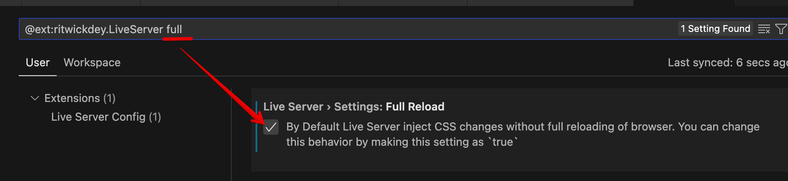

# Tailwind CSS Basic Playground
본 레포지토리는 [Tailwind CSS](https://tailwindcss.com) 환경 셋업에 아직 익숙하지 않은 개발자와 비개발자들이 손쉽고 빠르게 웹페이지 UI 디자인을 시작 할 수 있도록 공유되었습니다.

아래의 안내에 따라 `public` 폴더의 `index.html`을 수정하여 곧바로 Tailwind CSS를 사용해 볼 수 있으며, 자신이 디자인한대로 빌드된 아웃풋 파일(`style.css`)을 실시간으로 획득할 수 있습니다.

## ● 사전 필요사항
### 1) Node.js & npm 
> npm : Node.js 패키지 매니저. Node.js 를 설치하면 함께 설치되는 터미널 명령어 프로그램.

 [Tailwind CSS(위키)](https://en.wikipedia.org/wiki/Tailwind_CSS) 는 Node.js 패키지로 빌드되는 Post-processed CSS이므로 빌드하기위해 컴퓨터에 `npm`이 설치되어 있어야 합니다. npm은 Node.js를 설치하면 함께 설치됩니다. [Node.js 웹사이트](https://nodejs.org/en/)의 안내에 따라 자신의 컴퓨터에 Node.js를 **전역적으로** 설치해주세요.

 ### 2) Visual Studio Code & 확장
 로컬 HTML 파일을 실행하기엔 웹브라우저만으로도 충분하지만, html파일을 저장 할 때마다 웹브라우저를 새로고침해야하는 불편함이 따를 것입니다. 반면, 로컬웹서버에서 해당파일을 실행시키면 실시간으로 웹페이지가 리로드 할 수 있어 미리보기가 편리하며, 같은 로컬네트워크의 모바일 기기에서도 웹페이지에 접속해 볼 수 있습니다.

 어떤 코드에디터와 로컬서버로도 사용가능하지만, `VS Code`에서 `Live Server` 확장을 이용하면 로컬웹서버를 실행해 곧바로 작업중인 `html`파일에 맞는 페이지를 실행시킬 수 있습니다.

먼저 VS Code가 없다면 [Visual Studio Code](https://code.visualstudio.com)를 자신의 컴퓨터에 다운로드하여 설치해주세요.

#### ♠ Live Server 확장 설치
다음으로는 VS Code에서 곧바로 로컬웹서버를 실행시킬 수 있는 `Live Server` 확장을 설치합니다.

또한 다음과정을 통해 설정을 미리하면 좋습니다.

* Full Reload 설정:
  * 

* Local IP 사용 설정
  * 
  * > 로컬 IP 사용으로하면 Live Server로 웹브라우저가 열릴 때 현재 네트워크의 로컬IP가 표시된 URL이 나옵니다. 이 주소로 모바일에서도 접속해 볼 수 있습니다.

#### ♠ Tailwind CSS Intellisense 
추가로, `Tailwind Labs`사의 `Tailwind CSS Intellisense` 확장을 설치하면 Tailwind CSS의 `class` 이름 자동완성 기능을 사용할 수 있습니다.

## ● 레포지토리 다운로드 및 Tailwind CSS 설치
이 Github 레포지토리를 로컬에 다운로드 받아 압축을 풀고 나오는 폴더를 VS Code에서 엽니다.

### Tailwind CSS 모듈 설치
Tailwind CSS 모듈설치에 필요한 모든 것들은 이미 `package.json`에 명시되어있습니다. 

`VS Code`의 `Terminal` 창을 열고 (`Control`+`Shift`+`~` ) 아래 명령어를 입력해서 필요한 모듈을 설치합니다.

~~~
npm install
~~~

> 명령어 실행위치는 `package.json`파일이 위치한 레포지토리 폴더여야합니다. VS Code에서 레포지토리를 정상적으로 열었다면 해당 위치일 것입니다.

설치가 완료되면 `node_modules`폴더가 생성되고 그 안에 모든 모듈이 다운로드 받아진 것을 볼 수 있습니다.

## ● 페이지 디자인 시작 및 실시간 미리보기

### 1) index.html 파일
`public/index.html`을 열고 여기에서 웹페이지를 디자인할 수 있습니다. Tailwind CSS 아웃풋 파일은 아래와 같이 링크되어있습니다만 최초 빌드 전에는 아직 파일이 존재하지 않습니다.

또한 다른 페이지가 추가로 필요하다면 `public` 폴더 하위에 `html`파일을 만들고 위와같이 `<head>`태그안에 아웃풋 파일을 링크해 사용해주세요.

### 2) 아웃풋 파일 실시간 자동 빌드 실행
Tailwind CSS는 html,js 파일에서 사용된 `class=""` 이름들에 대해서만 출력파일을 만드는 Post-processed CSS 입니다. 현재 레포지토리는 `public`폴더에 있는 `.html`, `.js` 파일을 인식하도록 설정되어있습니다.

`VS Code`의 `Terminal` 창을 열고 (`Control`+`Shift`+`~` ) 다음명령어를 입력하세요. 
~~~
npm run tailwind
~~~
> 참고: 이 명령어는 Tailwind CSS 인풋파일에서 아웃풋파일을 만드는 긴 명령어를 편의를 위해 축약한 것이며, `package.json`의 `scripts`에 정의해둔 커스텀 `npm run` 명령어입니다.

> 자동빌드 프로세스를 중지하려면 터미널에서 `Control`+`C`키를 누르십시오.

이 자동빌드 프로세스가 실행중이면 html 파일을 수정해서 저장 할 때마다 사용된 클래스명을 인식해 자동으로 `public/style.css` 파일이 생성, 업데이트 됩니다.

### 3) Live Server로 로컬서버 실행해서 미리보기
현재 작업중이 `.html`파일의 코드편집 화면에서 마우스 우클릭 메뉴로  `Live Server`를 열거나, VS Code 오른쪽 하단에 나오는 `Go Live` 버튼을 클릭하면 현재 작업파일에 해당하는 로컬서버 주소로 실행됩니다.

> 참고: VS Code에서 현재 작업중인 문서가 `.html`파일이 아니면 폴더 구조가 출력될 뿐입니다.

이제 `index.html` 파일을 수정하고 저장 할 때마다 열려있는 웹브라우저가 자동으로 리로드되는 것을 볼 수 있습니다.

Live Server로 웹페이지가 열리면 위 2)번에서의 자동빌드 프로세스가 실행중이 아니더라도 웹브라우저가 자동 리로드는 될 것이지만, Tailwind 아웃풋파일이 빌드되지 않으면 새롭게 추가하는 CSS 클래스명은 반영되지 않을 것이므로 2)와 함께 쓰시기 바랍니다.

## ● 추가 추천 사항 선택

### inline fold 확장
Tailwind CSS 는 HTML 파일의 `class` 값이 많아지면서 줄이 매우 길어지는 특징이 있습니다. 그에따라 class 값만 코드를 folding 해서 보고 싶을 것입니다. VS Code에는 이를 위한 확장이 여럿있으므로 선택해서 사용 해보세요.

### Automatic Sorting
 모든 html 문서의 모든 DOM Elements에 거쳐 적용된 CSS Rule의 순서는 일관성을 갖는 것이 좋습니다. 그렇지 않다면 CSS 디버깅이 어려워질 수 있습니다. 

 Tailwind CSS의 Utility Class들 또한 CSS Rule 임에따라 이것들의 작성순서를 맞추는게 좋으므로 [Automatic Sorting](https://tailwindcss.com/blog/automatic-class-sorting-with-prettier)이 권장됩니다. 

 다음 중 하나의 방법으로 클래스를 재정렬 해보세요.

 #### 1) npm run prettier 명령어
본 레포지토리에는 Prettier의 설정파일인 `prettier.config.js`에 `prettier-plugin-tailwindcss`플러그인 설정이 추가되어 있으며 축약 명령어가 세팅 되어 있습니다. 터미널에서 다음 명령어를 입력하면 html 포매팅과 함께 `class=""` 내부의 클래스명들이 재정렬 됩니다.
~~~
npm run prettier
~~~
> 현재 터미널에서 이미 웃풋파일 자동빌드 프로세스가 실행중일 것이므로 새로운 터미널 창을 열어서 사용해보세요. 

 #### 2) Prettier VS Code 확장
VS Code의 확장으로 `Prettier - Code formatter` by Pretter 확장이 있습니다.  관련 설정은 이미 1)에서 세팅되어있으므로 이 확장을 설치하면 손쉽게 단축키로 코드 포맷팅과 함께 Tailwind CSS 클래스 재정렬을 수행 할 수 있습니다. 

### 3) Headwind 확장 
위 1)과 2)는 [Prettier](https://prettier.io/) 코드 포매팅을 이용해서 Tailwind CSS 클래스 재정렬을 하는 것입니다. Prettier는 다양한 언어의 포매팅을 설정해서 사용할 수 있지만 Prettier 사용자가 아니라면 자신이 사용하는 포매팅툴과 포맷양식이 달라 마음에 들지 않을 수 있습니다. 혹은 설정을 따로 맞춰야 하는 번거로움이 있을 것입니다.

 VS Code의 [Headwind](https://marketplace.visualstudio.com/items?itemName=heybourn.headwind) 확장은 포매팅과 무관하게 CSS `class` 값만을 재정렬 해줍니다. html문서를 저장하는 순간 혹은 단축키를 통해 Tailwind CSS 클래스를 재정렬 할 수 있습니다.